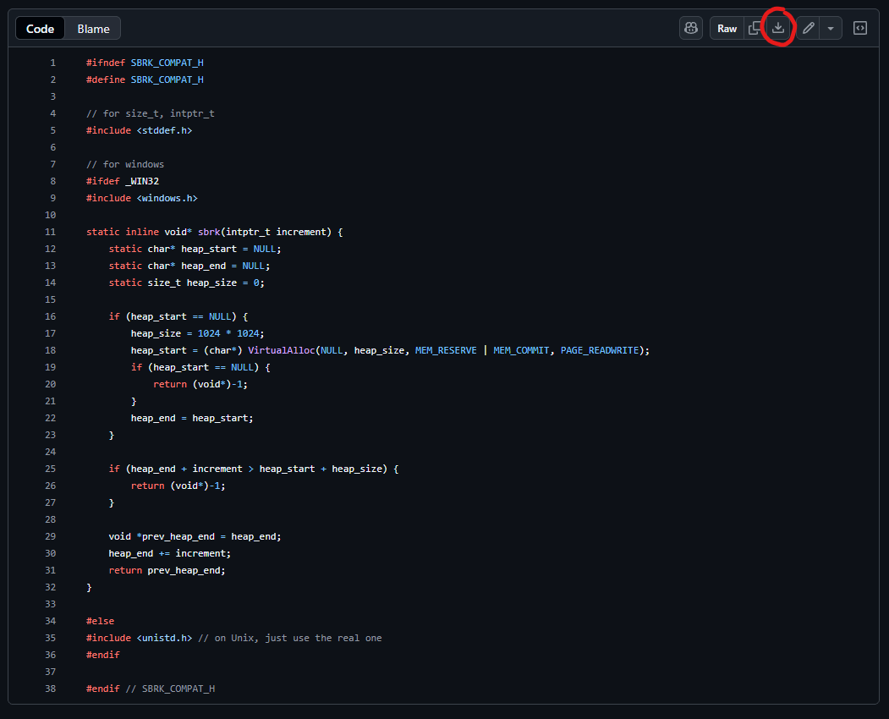

# sbrk compatibility header for Windows systems
Because Windows does not support the `sbrk` function, I created this header to mimic the interface and behavior of the `sbrk()` function used in real Unix systems using Windows' `VirtualAlloc` function. Do note however, that it does not actually interact with hardware in the way that `sbrk()` would in real Unix systems. The heap is entirely managed in user space; the OS kernel does not track it like areal Unix heap.

# What is `sbrk`
`sbrk` is a C library function that interacts with the operating system to manage a process's data segment, specifically the heap. It allows program to dynamically increase or decrease the amount of memory allocated to a segment.
- Calling `sbrk(0)` gives the current address of program break (end of the heap).
- Calling `sbrk(x)` with a positive value increments brk by x bytes, as a result allocating memory.
- Calling `sbrk(-x)` with a negative value decrements brk by x bytes, as a result releasing memory.
- On failure, `sbrk()` returns `(void*) -1`.

# Usage
1. Download the header file (`sbk_compat.h`)

2. Put it into your project directory
3. Put `#include "sbk_compat.h"` in your project